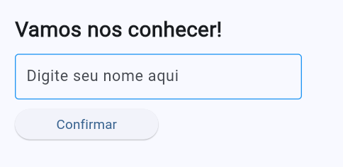
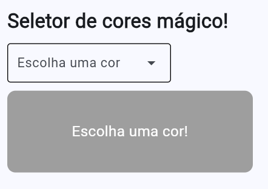
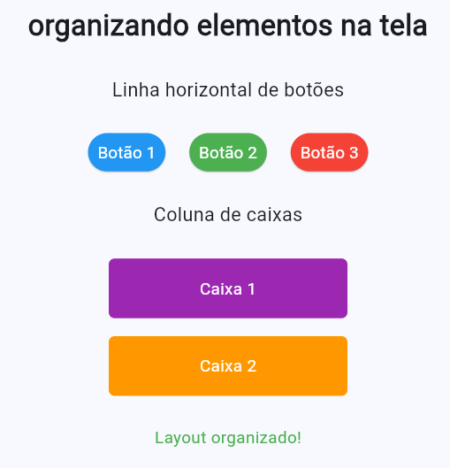
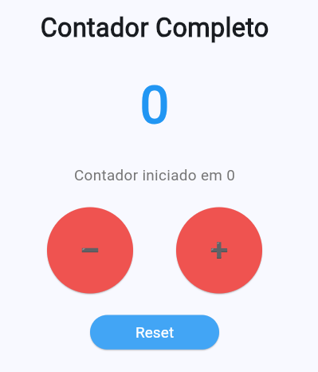
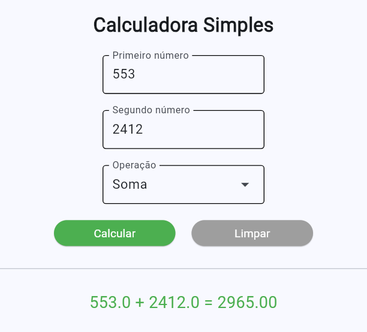
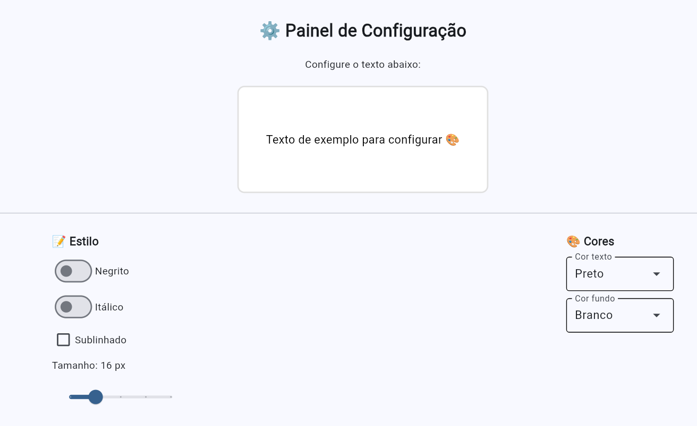
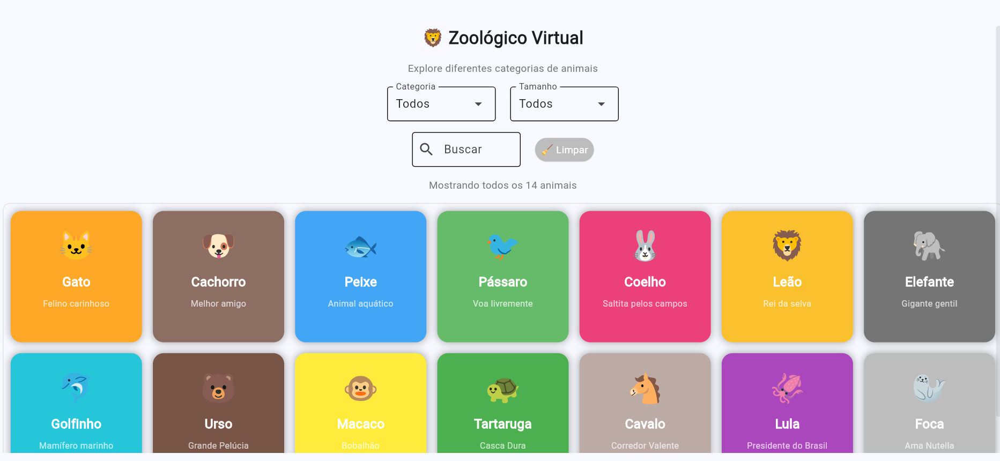
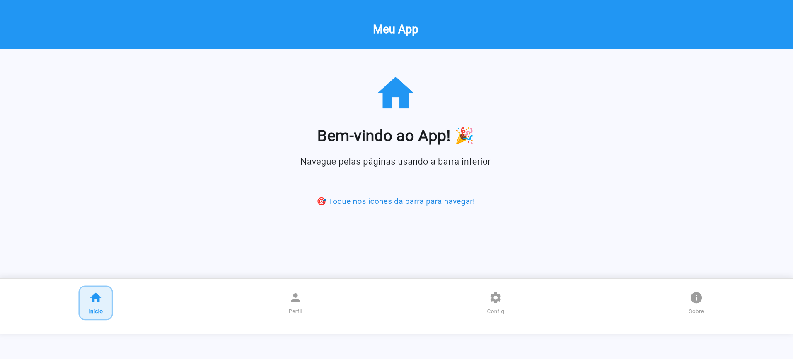
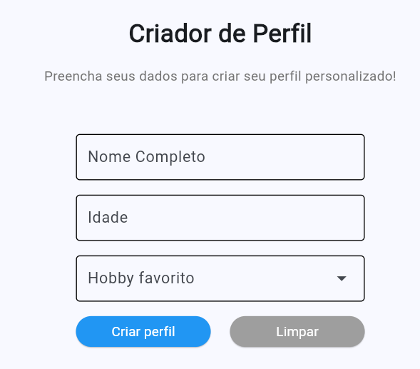
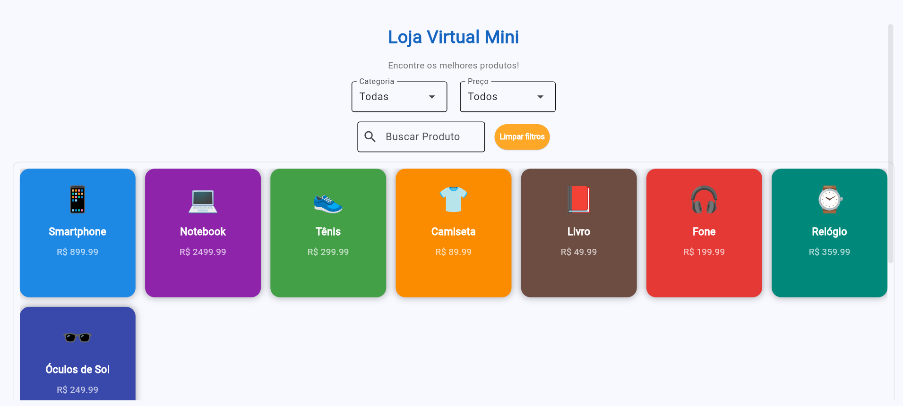

# PROGRAMAÇÃO DIRECIONADA A MOBILE UTILIZANDO PYTHON 🐍

__Aplicações e aprendisado utilizando o framework *Flet* para programar usando python direcionado à plataformas mobile.__

Esse repositório contém o primeiro uso + 10 atividades utilizando o framework *Flet* para criar programas de *Python*, e também 2 desafios desenvolvidos sem apoio dos professores

## Flet-00: Primeira interação com o flet

Um programa simples apenas para introduzir o flet e iniciar com o python, contém apenas 1 arquivo e o framework do Flet, também inclui instruções de como instalar e iniciar o flet

## Flet-01: Atividades e desafios

Uma série de programas para introduzir e ensinar as muitas funções do Flet de forma intuitiva, mostrando as diversas formas de como funciona e se aplica os vetores e funções trazida pelo framework
 <strong>Abaixo está os programas produzidos</strong>

### 01 - Primeiro programa
Um programa "Hello, world!" para introduzir os básicos de uso e identação

### 02 - Botão simples
Um botão que produz uma linha de texto quando pressionado muda a linha de texto acima

### 03 - Campo de texto
Uma input que produz um texto quando digita seu nome e clica o botão, contém programação que não deixa proceder se não for inserido um texto

### 04 - Lista de cores
Aplicação de um seletor com uma lista de cores e um container que muda de cor e o texto de acordo com a cor escolhida no seletor

 

### 05 - Layout básico
Aplicação de ferramentas de alinhamento para organizar um layout simples

### 06 - Contador
Um contador que inicia em 0 e aumenta ou diminui por 1 cada vez que os botões positivos ou negativos são pressionados, também pode-se observar se é uma quantia positiva pelo texto e cor dos números e vice-versa, finalizado com um botão para resetar o contador

 

### 07 - Calculadora
Uma calculadora que soma, subtrai, multiplica ou divide 2 números e te dá o resultado, também possui um boão para resetar

### 08 - Painel de Configurações
Um painel com multiplas funções que deixa você estilizar uma caixa de texto apenas interagindo com as opções presentes

### 09 - Galeria de zoológico
Uma página com estilo galeria que permite o usuário pesquisar animais por meio de nome ou filtros

### 10 - Site multipáginas
Finalmente, uma aplicação por meio de um site com múltiplas funções, principalmente a abilidade de mudar entre as diferentes páginas do site como

## 05A - Desafio 1
O primeiro desafio realizado, o objetivo sendo produzir um gerador de perfil de acordo com o conhecimento aprendido até o desafio 5

## 10A - Desafio 2
O segundo desafio, com o objetivo de produzir uma mini loja com um carrinho que guarda e visualiza a informação sobre o que o usuário quer comprar

 <strong style="color: #00aaff; font-size: 16px">Imagens demonstrando o funcionamento de cada página pode ser encontrada dentro da pasta do flet-01</strong>